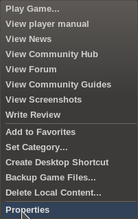
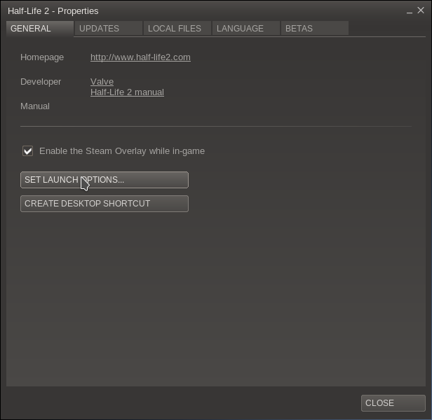
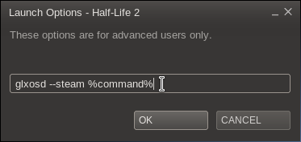
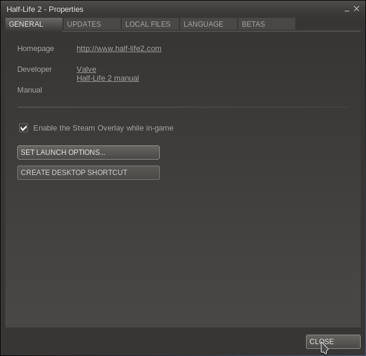

* TOC_GOES_HERE
{:toc}

# General usage #

To use GLXOSD you'll need to launch the application you want it to display in using the `glxosd` command. All you have to do is prefix the command you use to launch the application with <code>glxosd </code>. For example, if you want to launch glxgears, you will have to run this:

glxosd glxgears


And if you want to run Minecraft, you'll have to run this:

glxosd java -jar Minecraft.jar


To remove the need of launching the application through the terminal, you should just edit the launcher for that application to include GLXOSD in the command.

# Steam games #

1. Right click on the game in Steam.\\

2. Click "Properties" in the context menu.\\

3. Click "SET LAUNCH OPTIONS..." in the properties window.\\

4. Paste `glxosd --steam %command%` into the text box that appears.\\

5. Click OK.\\

6. And finally, click Close.

7. Done! You can now start the game and you should see GLXOSD in it. If the game starts without GLXOSD or doesn't start at all, please [send me an email](mailto:nickguletskii200@gmail.com) or file an issue on the [issue tracker](https://github.com/nickguletskii/GLXOSD/issues?state=open).

# Additional options #

glxosd [options] command

### Launch with a different config ###

--config PATH_TO_CONFIG


or:


-c PATH_TO_CONFIG


Example:


glxosd --config ~/myglxosdconfig.conf glxgears


### Launch GLXOSD with Steam overlay ###

--steam


or:


-s


Example:


glxosd --steam glxgears


### Specify the path to Steam ###


--steam PATH_TO_STEAM


Example:


--steam-path ~/.local/share/Steam 
